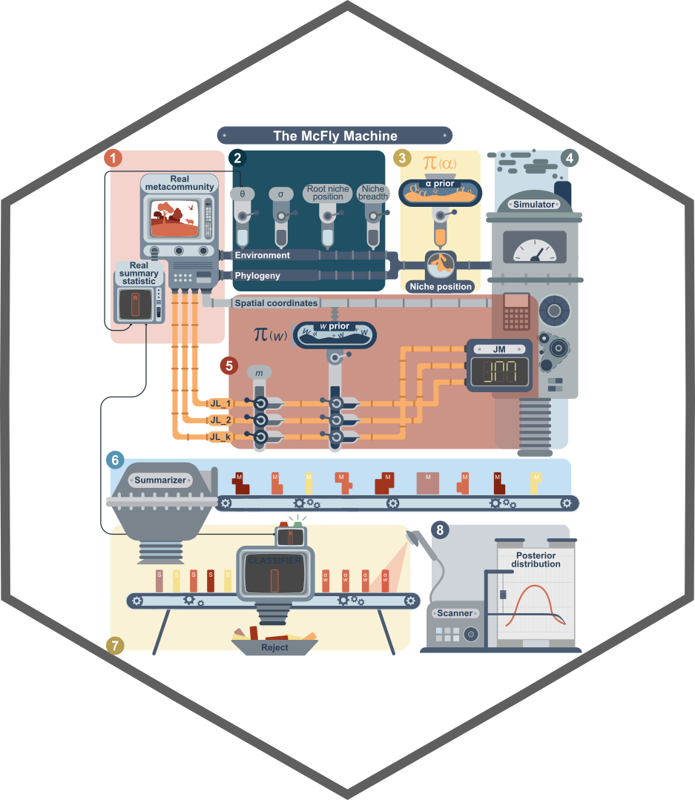

# mcfly

[](https://cran.r-project.org/package=mcfly)

[](https://choosealicense.com/licenses/mit/)

**mcfly** - Simulation framework to estimate the influence of niche adaptation rate and dispersal limitation on species diversity distribution across environmental gradients

## Description
We introduce mcfly, an R package to estimate the influence of niche adaptation 
    rate and dispersal limitation on species diversity distribution of a given phylogenetic lineage across environmental gradients.
    For this, mcfly adopts the individual-based metacommunity simulation framework algorithm implemented in the package 
    MCSim (See MCSim package for more information on individual based model) coupled to Approximate Bayesian Computation (ABC) 
    to estimate the posterior distribution of (i) the adaptation rate parameter of Ornstein-Uhlenbeck (OU) 
    evolutionary model and (ii) the slope the dispersal kernel, i.e, the probability density function of the dispersal success from 
    a source to a sink assemblage)that maximizes the association between species diversity across a set of sites and a given environmental gradient.

## Installation

To install mcfly package use:
```{r, eval=FALSE, echo=TRUE}
devtools::install_github("GabrielNakamura/mcfly", force = T, build_vignettes = T)
```


To run the vignette:
```{r, eval=FALSE, echo=TRUE}
vignette("McFly_vignette")
```


**Important**: after installation, relaunch R
